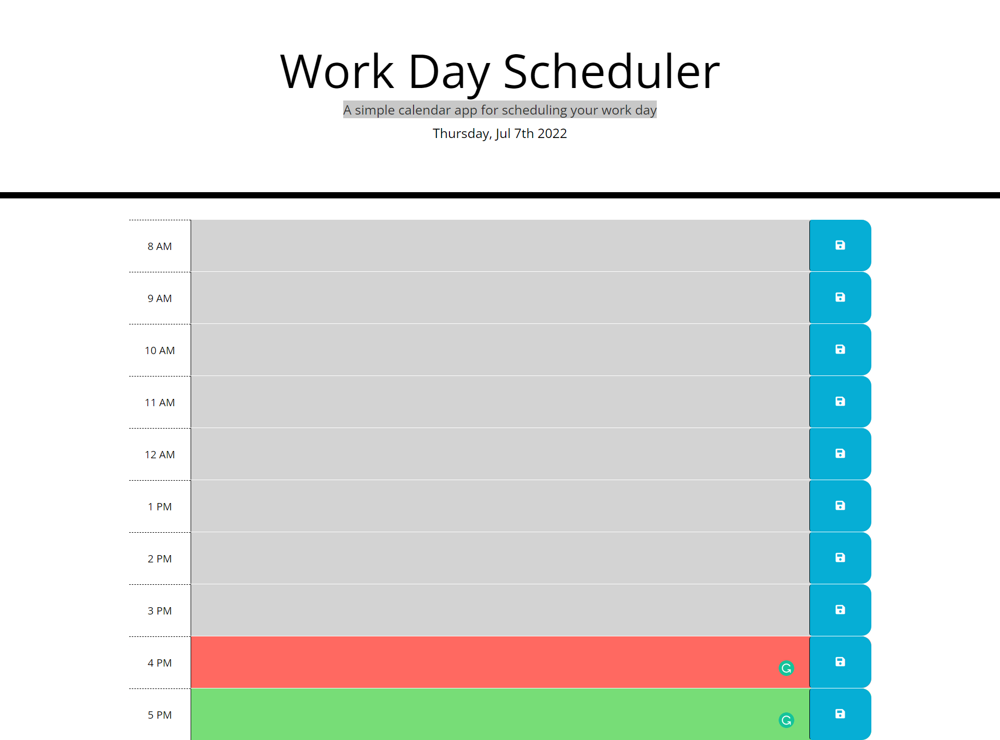

# Challenge V

## Description
In this challenge, a calendar is made to save to-do tasks for a day. The color of each time in the calendar can change upon the actual time which can help the user to manage their tasks and time. JQuery and Bootstrap are used to minimize the effort and make the HTML and JS files easier to manage.

## Screenshot

## Application URL
https://tien24196.github.io/Code-for-fun/